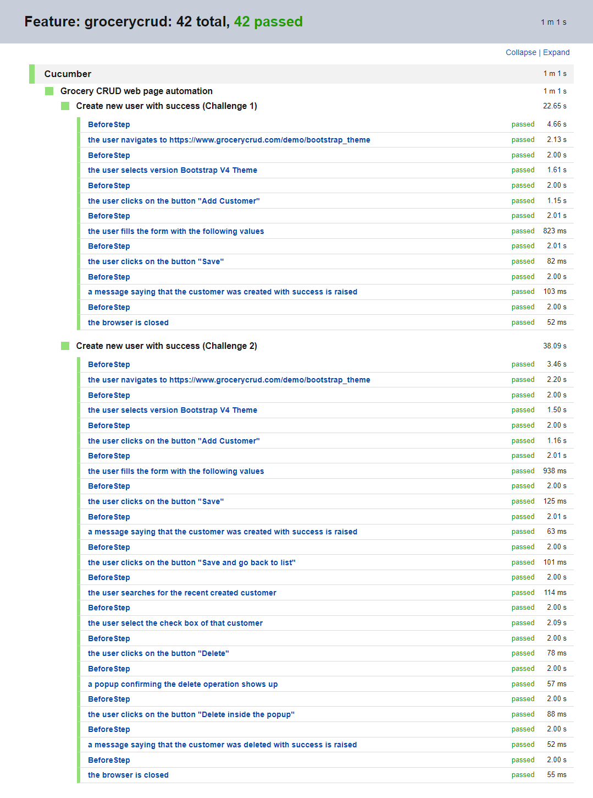
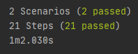

# 👨‍💻 QA Java, Cucumber and Selenium Challenge

<div align="center">
  
</div>
<br>

Test Automation of [this bootstrap web page](https://www.grocerycrud.com/demo/bootstrap_theme) using Java, Cucumber, and Selenium.

The features of the tests are inside `src/test/resources/prova_sicredi/grocerycrud.feature` and the step definitions are inside `src/test/java/prova_sicredi/StepDefinitions.java`

## 📅 Test execution report

- [Link to test execution report HTML](Test_Results_Feature__grocerycrud.html)
- [Link to test execution report PDF](Test_Results_Feature_grocerycrud.pdf)

## 💾 Development Dependencies Used

- "Apahce Maven": "3.6.3"
- "Java":  " 11.0.9.1"
- "Selenium": "3.141.59"
- "Cucumber": "6.10.4"
- "Chrome Driver": "90.0.4430.24"
- "Google Chrome": "90.0.4430.212"

## 🎬 Getting Started

1. Clone the project into your machine, install all dependencies described above and compile the project using:

```console
mvn install
```

2. Now, to run the tests:

```console
mvn test
```

3. Verify the tests results output:



---

Made with ❤️ by Matheus Beck 👋 [Get in touch!](https://www.linkedin.com/in/matheus-beck/)
